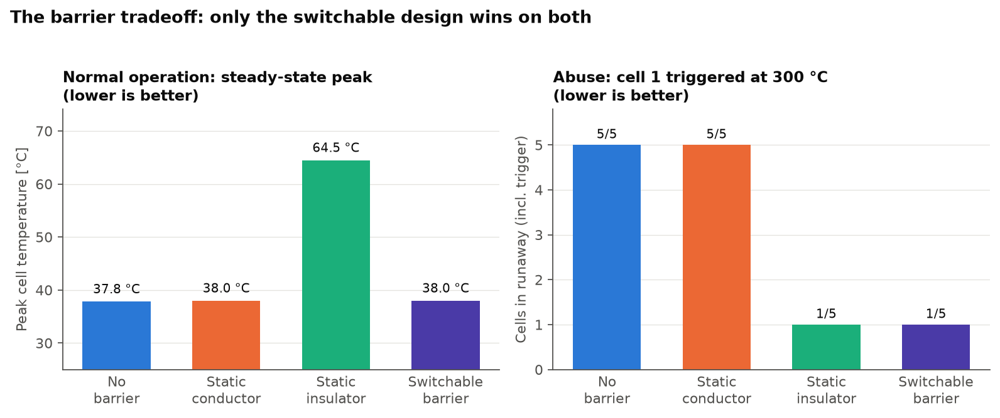
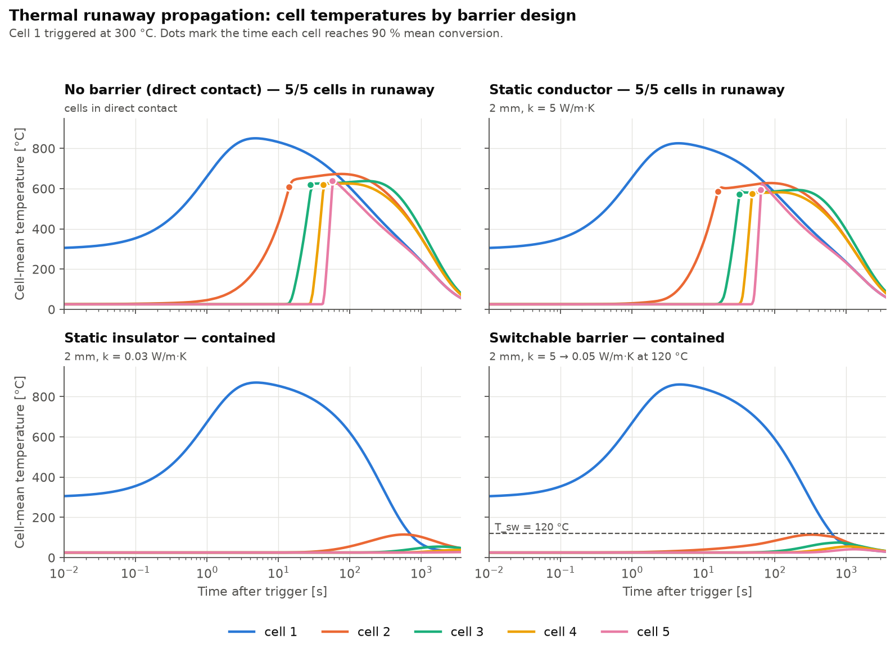
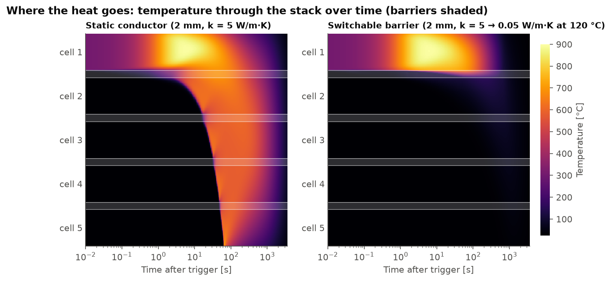
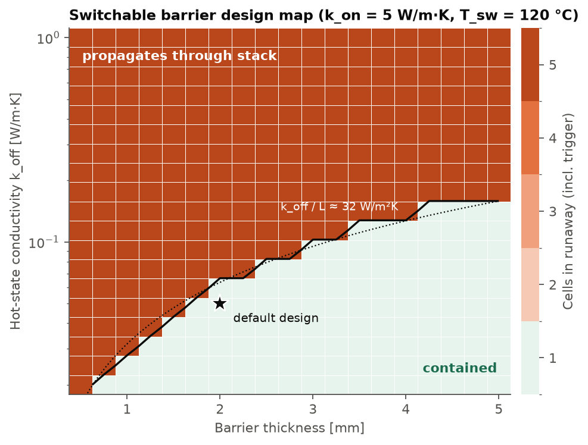
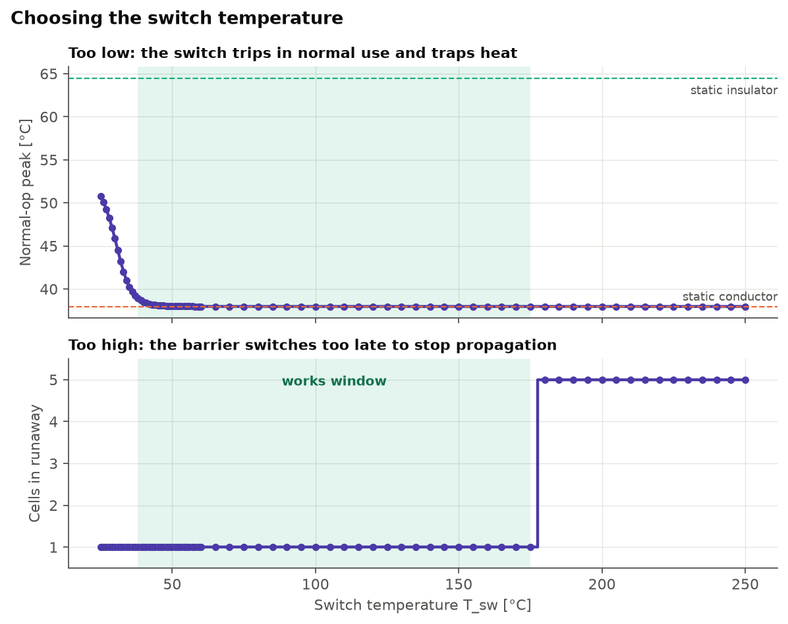

# runaway: thermal runaway propagation with switchable thermal barriers

A small, tested 1D finite-volume model of **thermal runaway propagating through a
stack of lithium-ion cells**. It compares four inter-cell barrier designs,
including a **temperature-switchable barrier** that conducts heat in normal
operation and insulates once it gets hot.

> **All parameters are illustrative.** The numbers in
> [`runaway/params.py`](runaway/params.py) are order-of-magnitude placeholders
> chosen to make the physics visible. They are not taken from or calibrated
> against any specific publication or measurement. Each one has a `TODO` marking
> where a literature-sourced or measured value belongs. The *qualitative*
> conclusions are the point; the specific temperatures and times are not
> predictions for any real cell.



## Motivation

A barrier between cells has two jobs that pull in opposite directions:

| Barrier | Normal operation | Abuse (one cell in runaway) |
|---|---|---|
| **Conductor** | ✅ spreads heat to the cooled ends, so cells stay cool | ❌ hands the runaway cell's heat straight to its neighbour |
| **Insulator** | ❌ traps the cells' own heat, so they run hotter | ✅ blocks heat flow and stops propagation |
| **Switchable** (conducts below T_sw, insulates above) | ✅ behaves like the conductor | ✅ behaves like the insulator |

Thermal switches and temperature-responsive barriers are an active research
area. Two entry points:
[*Rapid temperature-responsive thermal regulator for safety management of battery modules* (Nature Energy, 2024)](https://www.nature.com/articles/s41560-024-01535-5)
and the review
[*Thermal switches for lithium-ion battery thermal management: Principle, performance and application* (Energy Storage Materials, 2025)](https://www.sciencedirect.com/science/article/abs/pii/S2405829725004787).
This project is a minimal computational testbed for that idea. It asks
quantitatively when a switch gives you both benefits, and what it has to
achieve (hot-state conductivity, thickness, switch temperature) to do so.

## Model

### Geometry

```
 h, T_amb                                                         h, T_amb
   ──▶ │ cell 1 │▒│ cell 2 │▒│ cell 3 │▒│ cell 4 │▒│ cell 5 │ ◀──
        10 mm   2 mm barrier (▒)                           x ─▶
```

Five 10 mm cells with barriers between them (default 2 mm). Heat flows through
the stack thickness only, and the two ends are cooled convectively.

### Governing equations

Transient heat conduction with temperature-dependent conductivity and a
reaction source:

$$
\rho c_p \frac{\partial T}{\partial t} = \frac{\partial}{\partial x}\!\left(k(T)\,\frac{\partial T}{\partial x}\right) + q_\text{rxn} + q_\text{gen}
$$

with convective (Robin) ends

$$
-k\frac{\partial T}{\partial x}\Big|_{x=0} = h\,(T_\infty - T), \qquad
k\frac{\partial T}{\partial x}\Big|_{x=L} = h\,(T_\infty - T).
$$

**Cell self-heating.** Single-step Arrhenius kinetics for a lumped reaction progress
$\alpha \in [0,1]$ at every cell node:

$$
\frac{d\alpha}{dt} = k_\text{eff}(T)\,(1-\alpha), \qquad
q_\text{rxn} = \Delta H_v \frac{d\alpha}{dt}, \qquad
\Delta H_v = \rho c_p\,\Delta T_\text{ad},
$$

$$
k_\text{eff} = \frac{k_\text{arr}\,k_\text{max}}{k_\text{arr} + k_\text{max}}, \qquad
k_\text{arr} = A\,e^{-E_a/RT}.
$$

With $E_a = 169$ kJ/mol and $A = 7.3\times10^{16}$ s⁻¹, $k_\text{arr}$ is about
$10^{-4}$ s⁻¹ at 150 °C (slow onset) and about 1 s⁻¹ at 250 °C. The ceiling
$k_\text{max}$ is explained under [Numerics](#why-there-is-a-rate-ceiling-k_max).

**Switchable barrier.** A smooth, reversible sigmoid between $k_\text{on}$ (cold)
and $k_\text{off}$ (hot), blended in log space:

$$
\ln k(T) = \ln k_\text{off} + \frac{\ln(k_\text{on}/k_\text{off})}{1 + e^{(T - T_\text{sw})/w}}
$$

so $k(T_\text{sw}) = \sqrt{k_\text{on}k_\text{off}}$. Each barrier node switches
on its own local temperature, so a barrier can be half on and half off.

**Normal operation.** The same conduction equation, with uniform volumetric heat
generation $q_\text{gen}$ in the cells and no reaction, solved to steady state.

### Parameters (illustrative)

| Quantity | Value | Notes |
|---|---|---|
| Cell $k$, $\rho$, $c_p$ | 0.8 W/m·K, 2500 kg/m³, 1000 J/kg·K | through-plane, homogenised |
| $E_a$, $A$, $\Delta T_\text{ad}$ | 169 kJ/mol, 7.3×10¹⁶ s⁻¹, 600 K | single-step lumped kinetics |
| $k_\text{max}$ | 1 s⁻¹ | rate ceiling (see Numerics) |
| Conductor | $k$ = 5 W/m·K | static |
| Insulator | $k$ = 0.03 W/m·K | aerogel-like, static |
| Switchable | $k_\text{on}$ = 5, $k_\text{off}$ = 0.05 W/m·K, $T_\text{sw}$ = 120 °C, $w$ = 5 K | reversible |
| Barrier $\rho c_p$ | 1.0×10⁶ J/m³·K | same for all designs, to isolate the effect of $k$ |
| End cooling $h$, $T_\infty$ | 100 W/m²·K, 25 °C | |
| Normal-op generation | 2×10⁴ W/m³ | |
| Trigger | cell 1 starts at 300 °C | |

#### What I tuned, and why

The specification's starting values were kept except for the following changes.
Each is documented in the code.

1. **End cooling h = 100 W/m²·K.** With natural-convection values (h ≲ 30) *no*
   barrier, not even the 0.03 W/m·K insulator, stops propagation in this 1D
   model. The stack ends are the only heat sink, so cell 1's ~20 MJ/m² must
   eventually cross the barrier unless the end can remove it faster. 100 W/m²·K
   stands for an end plate tied to a cooling system. This dependence is a real
   feature of the 1D idealisation (see Limitations).
2. **Rate ceiling $k_\text{max}$ = 1 s⁻¹.** Without it the propagation time
   does not converge with the mesh. Details below.
3. **Log-space switch blend.** A linear blend of a 100× switch leaves
   $k \approx 3k_\text{off}$ until ~20 K past $T_\text{sw}$, so the switch
   barely insulates near its nominal temperature. A log blend makes the width
   $w$ act symmetrically.

## Numerics

* **Finite volumes** on a layer-conforming mesh (40 volumes per cell, 12 per
  barrier), so every material interface sits on a face. The face conductance is
  the series resistance of the two half-volumes:
  $G_{i+1/2} = \left(\tfrac{\Delta x_i}{2k_i} + \tfrac{\Delta x_{i+1}}{2k_{i+1}}\right)^{-1}$,
  the distance-weighted **harmonic mean**. It is exact for layered steady
  conduction and handles the 27× conductivity jump at an aerogel/cell
  interface without special treatment.
* **Lie operator splitting**, one reaction step then one conduction step:
  * **Reaction:** for a frozen rate constant the progress ODE is linear, with the
    exact solution $\alpha^{n+1} = 1 - (1-\alpha^n)\,e^{-k_\text{eff}\Delta t}$.
    $k_\text{eff}$ is evaluated at a predicted mid-step temperature (exponential
    midpoint, second order). The update is stable for any $\Delta t$, keeps
    $0\le\alpha\le1$, and adds exactly $\Delta T_\text{ad}\,\Delta\alpha$, so
    the stiff kinetics cannot blow up.
  * **Conduction:** backward Euler with $k(T)$ lagged from the previous step
    (optional Picard iterations via `SimParams.picard_iters`). The tridiagonal
    system is solved with `scipy.linalg.solve_banded`.
* **Adaptive step.** $\Delta t = \min(\Delta t_\text{max},\ \Delta T_\text{rxn,max} / \max \dot T_\text{rxn})$,
  with $\Delta T_\text{rxn,max}$ = 2 K. This is an accuracy limit, not a
  stability limit. It shrinks the step only while some node is actively
  igniting.
* **Energy bookkeeping.** The solver tracks thermal energy plus unreleased
  chemical energy plus cumulative boundary losses. The scheme is conservative,
  so the residual stays at round-off: about 10⁻¹² relative in every run shown
  here.
* **Normal-operation steady state** is reached by pseudo-transient continuation:
  backward-Euler steps from ambient with a growing $\Delta t$. For a
  switchable barrier this follows the physical start-up path, so if the heating
  trips the switch the solution lands on the hot branch.
* A cell has **propagated** when its volume-mean $\alpha$ exceeds 0.9.

### Why there is a rate ceiling $k_\text{max}$

The kinetic parameters describe onset (150–250 °C). Extrapolated to a burning
cell at ~900 °C, pure Arrhenius gives $k \sim 10^9$ s⁻¹. That implies a reaction
front inside the cell only ~10⁻⁷ m thick. On any practical mesh the front is
unresolved, and each control volume ignites its neighbour after a delay that
scales with $\Delta x$. The convergence study exposed this: without the ceiling,
the cell-2 propagation time for the conductor case **halved with every mesh
refinement**, at about 13, 7.6, 4.7 and 3.3 s for 10, 20, 40 and 80 volumes per
cell.

Real high-temperature decomposition is limited by transport and multi-step
chemistry, not by an ever-faster single Arrhenius step. A smooth ceiling of
1 s⁻¹ leaves onset untouched and makes a single cell burn over a few seconds. It
also gives a front width $\sim\sqrt{\kappa/k_\text{max}} \approx 0.6$ mm that the
mesh resolves. With it, the solution converges:

| Volumes per cell | 10 | 20 | 40 (default) | 80 | 160 |
|---|---|---|---|---|---|
| Cell-2 propagation time, conductor [s] | 20.90 | 17.19 | 15.94 | 15.64 | 15.60 |

That is roughly second-order convergence; the default mesh is within 2 % of the
finest. Halving the reaction step tolerance changes the result by 0.1 %. The
contained cases are converged too: the peak temperature of cell 2 behind the
switchable barrier changes by < 0.1 K across a 100× range of $\Delta t_\text{max}$
and by ~1 K across 20 → 80 volumes per cell.

## Results

Regenerate everything with `python -m runaway.demo` (about 40 s on a laptop;
the sweeps run in parallel). The demo also writes these numbers to
`figures/summary.txt`:

| Design | Normal-op peak | Cells in runaway | Propagation times, cells 1–5 [s] |
|---|---|---|---|
| None (direct contact) | 37.8 °C | 5 / 5 | 2.3, 14.1, 28.2, 42.2, 56.1 |
| Static conductor | 38.0 °C | 5 / 5 | 2.3, 15.9, 31.8, 47.8, 63.6 |
| Static insulator | **64.5 °C** | **1 / 5** | 2.3, –, –, –, – |
| Switchable | **38.0 °C** | **1 / 5** | 2.3, –, –, –, – |

### a) Cell temperatures for each design



The trigger cell burns over a few seconds and peaks around 850–870 °C. That is
just below $300 + \Delta T_\text{ad} = 900$ °C, because it is already losing heat
while it reacts. With no barrier or a conductor, each neighbour ignites about
14–16 s after the previous one and the whole stack is gone within about a
minute. Each burnt cell settles near $25 + 600$ °C plus whatever preheating it
received. With the insulator or the switch, cell 2 peaks at only ~115 °C (cell
mean) and the stack cools back down.

### b) Where the heat goes



With the conductor, a reaction front crosses the stack. With the switchable
barrier, the hot face of the first barrier switches off and holds a steep
temperature drop of ~700 K across a couple of millimetres, while cell 1 dumps
its heat out the cooled end. The far side of that same barrier stays below
$T_\text{sw}$ and keeps conducting, as do the downstream barriers. That lets
cell 2 spread whatever heat leaks through into cells 3–5.

A subtle consequence: behind the switch, cell 2 peaks at a slightly *higher*
local temperature (153 °C, 3 % conversion) than behind the static insulator
(124 °C). Only the hot part of the switchable barrier is insulating, so its
effective insulating thickness is less than 2 mm. The design map below shows
how much margin that leaves.

### c) The tradeoff

The figure at the top of this page shows the tradeoff. The insulator buys
containment at a 27 K hotter steady state in normal operation. The switch keeps
the conductor's 38 °C *and* the insulator's containment.

### d) Design map for the switchable barrier



Barrier thickness (0.5–5 mm) against hot-state conductivity $k_\text{off}$
(0.02–1 W/m·K): 361 simulations. Two things stand out:

* **Outcomes are all-or-nothing.** Every run ends with either 1 or 5 cells in
  runaway. Once cell 2 goes, each later cell sees a trigger at least as severe,
  so the barrier has to stop the *first* hand-off.
* **The boundary is a constant hot-state conductance.** Containment holds when
  $k_\text{off}/L \lesssim 32$ W/m²·K, about a third of the end-cooling $h$.
  Physically, the runaway cell has to shed its heat to the cooled end faster
  than it leaks through the barrier. The default design (25 W/m²·K) sits about
  20 % below the boundary. A real design would want more margin, through a
  lower $k_\text{off}$ or a thicker barrier.

### e) Choosing the switch temperature



The same switchable barrier with $T_\text{sw}$ swept from 25 to 250 °C:

* **$T_\text{sw}$ too low (≲ 38 °C, i.e. near the normal operating temperature):**
  the barrier partly switches off in normal use and the steady peak climbs
  toward the insulator's.
* **$T_\text{sw}$ too high (≳ 175 °C):** by the time the barrier insulates, cell
  2's face is already past self-heating onset (~150 °C) and runaway propagates.
* **Window: about 38–175 °C.** In this window the switch both cools and protects.
  The upper edge tracks the kinetics; the lower edge tracks the operating
  temperature plus a few switch widths.

## Validation tests

`pytest` runs 18 tests in about 5 s:

| Test | What it checks |
|---|---|
| `test_conservation.py` | Insulated ends, no reaction, nonlinear switchable barrier: total thermal energy constant to 10⁻¹². With reaction, thermal + chemical energy constant. With convection, the energy budget closes to < 10⁻¹⁰. |
| `test_steady_conduction.py` | cell \| barrier \| cell between two ambients matches the analytical series-resistance solution (flux and piecewise-linear profile) to 10⁻⁸ K, for a 6× and a 27× conductivity jump, on a deliberately coarse mesh. Normal-op peak for one cell matches $T_\infty + qL/2h + qL^2/8k$. |
| `test_reaction.py` | A single adiabatic reacting node ends at exactly $T_0 + \Delta T_\text{ad}$. Its ignition time matches a tight-tolerance `solve_ivp` (Radau) reference within 1 %, with and without the rate ceiling. The exponential update stays bounded and conservative with absurdly large steps. |
| `test_convergence.py` | Cell-2 propagation time under grid refinement (observed order > 1.5, default within 3 % of finer) and reaction-step refinement (monotone, default within 1 %). |
| `test_designs.py` | Switch k(T) limits and geometric mean at $T_\text{sw}$; regression test of the headline result. |

## Limitations

* **1D.** Heat flows only through the stack thickness. Real packs lose heat
  sideways (to the cooling plate, the housing and busbars). That is why the
  result depends so strongly on the end-cooling coefficient $h$: in 1D the ends
  are the only way out.
* **Lumped single-step kinetics.** Real runaway involves several overlapping
  reactions (SEI decomposition, anode–electrolyte, cathode decomposition,
  electrolyte combustion, internal short). One Arrhenius step plus a rate
  ceiling captures onset and total heat release, not the detailed heat-release
  profile.
* **No venting, ejecta, gas flow or flame**, which in practice carry a large
  share of the energy and often dominate cell-to-cell propagation.
* **No radiation** across gaps, and **no contact resistance** at the cell/barrier
  interfaces.
* **Idealised switch:** instantaneous, reversible, no hysteresis, no degradation,
  same heat capacity as the static barriers, and no latent heat (unlike
  phase-change or endothermic barriers).
* **Illustrative parameters.** None of the values are fitted to data. Treat the
  temperatures and times as qualitative.

## How to run

```bash
git clone <this repo> && cd <this repo>
python -m venv .venv && source .venv/bin/activate
pip install -r requirements.txt
pytest                         # 18 validation tests, ~5 s
python -m runaway.demo         # regenerate figures/ (~40 s)
python -m runaway.demo --quick # coarse sweeps, ~10 s
```

Use the package directly:

```python
from dataclasses import replace
from runaway import StackParams, SimParams, simulate_runaway, solve_normal_operation
from runaway.params import barrier_switchable

stack = StackParams(barrier=barrier_switchable(thickness=3e-3, k_off=0.08, T_sw_C=100))
res = simulate_runaway(stack, SimParams(t_end=1800))
print(res.n_propagated, res.t_prop, res.max_relative_energy_error)
print(solve_normal_operation(stack).peak_C)
```

### Layout

```
runaway/
  params.py     all parameters (dataclasses, ILLUSTRATIVE, with TODOs)
  materials.py  layer-conforming FV grid, switchable k(T)
  solver.py     conduction + reaction time stepping, steady state, energy check
  scenarios.py  design comparison, design-map and T_sw sweeps
  demo.py       CLI: python -m runaway.demo -> figures/
tests/          pytest validation suite
figures/        generated figures + summary.txt
```

## Next steps

* **Fit $k(T)$ to measured barrier data.** Replace the sigmoid with a
  measured conductivity curve for a real switchable material, including
  hysteresis and cycling degradation.
* **Fit the kinetics** to accelerating-rate calorimetry of a specific cell,
  ideally with a multi-step model, and calibrate $k_\text{max}$ against measured
  runaway duration.
* **2D/3D** with lateral cooling to the cold plate, which removes the strong
  dependence on end cooling, plus contact resistance and radiation across gaps.
* **Compare against a COMSOL** (or other commercial FE) model of the same
  geometry as an independent code-to-code check.
* **Uncertainty quantification** over the illustrative parameters, to see which
  ones control the containment boundary.

## License

MIT. See [LICENSE](LICENSE).
